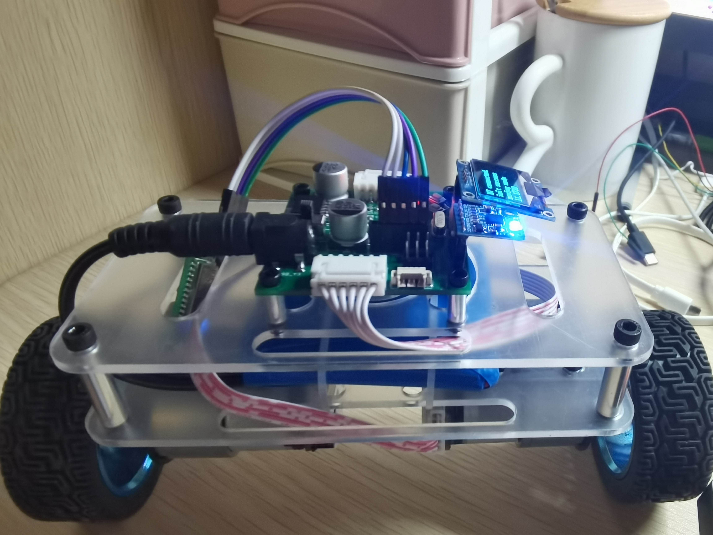
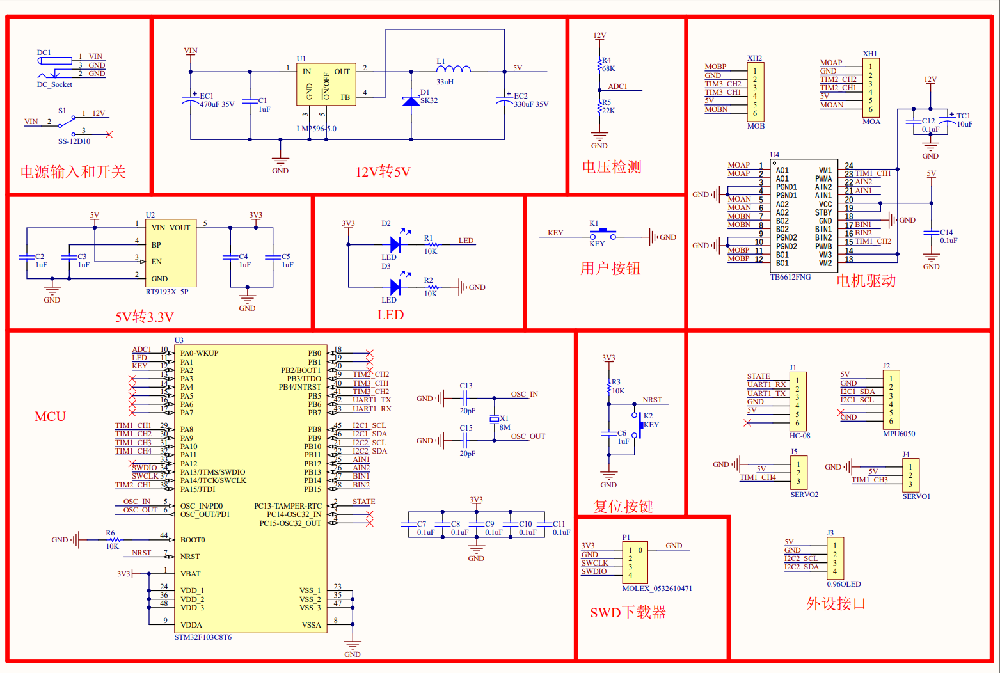
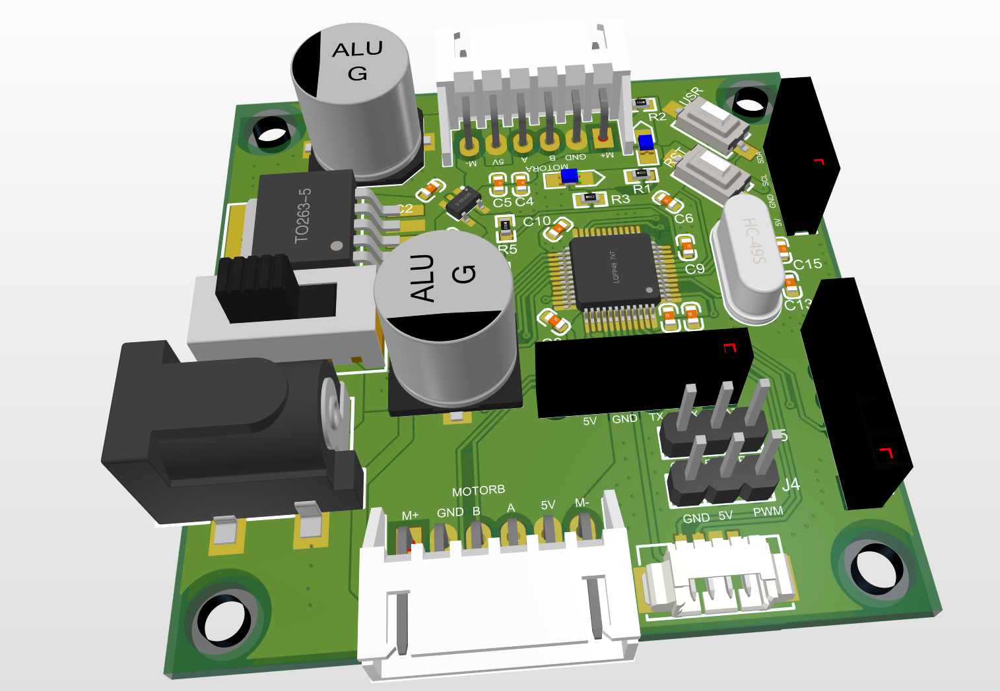
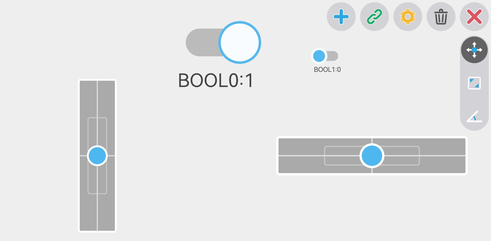

# 基于LQR算法的平衡车

- [基于LQR算法的平衡车](#基于lqr算法的平衡车)
  - [概述](#概述)
  - [开源文件解析](#开源文件解析)
  - [硬件部分](#硬件部分)
  - [控制部分](#控制部分)
  - [机械部分](#机械部分)
  - [总结](#总结)
## 概述

  本开源项目主要分享的是一款有STM32F103C8T6控制芯片控制的平衡小车，平衡算法主要使用一阶线性倒立摆模型，在Matlab利用LQR算法计算出反馈矩阵，通过MPU6050以及电机编码器反馈实现平衡以及转向的控制。本项目主要是记录我绘制的第一块pcb以及第一次使用Markdown。

## 开源文件解析

* 建模：主要是solidworks文件，比较简单，主是为了固定电路板和电机
* 平衡车驱动板：AD文件，个人绘画的第一块板子
* matlab_source: Matlab计算文件
* MyPHC_F103C8T6: 代码

## 硬件部分

1. 主控板
    
    
    主控板主要是集成电压转换模块，电机驱动模块，主控芯片以及一些外设接口，内容比较简单。但由于是本人第一次绘制PCB，经历了电路设计，电路绘制，元件采购再到最后的焊接，学到非常多的东西，所以这一块板子是非常具有**纪念价值**。板子中的所有功能都可正常使用，唯一不足是蓝牙接口的TX和RX没有与购买的蓝牙设备相对应，所以只能用杜邦线将RX和TX对接一下。

2. 电机
    
    电机我使用的是光电编码器的直流减速电机MG513P3012V，使用这款电机主要是大一立项剩下的，拿出来使用总好过放盒子积灰。但我**不推荐**使用这种电机作为平衡车的驱动轮，最主要的原因是电机的**虚位**很大，所以很难在平衡位置实现平衡，只会在在附近来回摆动。

3. 外设
    蓝牙：HC-08

    陀螺仪: MPU6050(正点原子)

    电池: 12V2800mAh锂电池(容量无所谓，跟你设计的小车大小有关)

    屏幕: 0.96寸OLED

## 控制部分

* 物理建模

---经过计算化简以及线性化处理之后就可以得到状态空间方程

调整Q和R矩阵，经过matlab的lqr()函数计算，最终得到状态反馈矩阵

---

* 蓝牙控制
  
小车控制主要是使用手机蓝牙通信
在这里我使用的是蓝牙调试器，自己设计控制组件

## 机械部分

能够固定板子和电机就行，本身结构就非常简单

## 总结

由于LQR的强鲁棒性，小车不需要过多调整参数便可实现很好的控制。

小车在静止平衡状态下由于电机虚位，会小幅度摆动，在运动状态下能够很好地根据命令运行。

